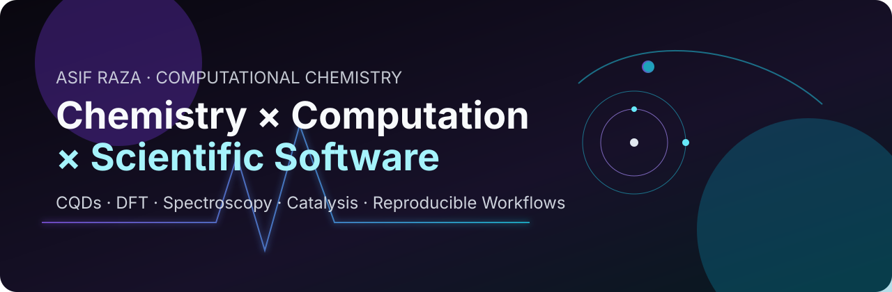
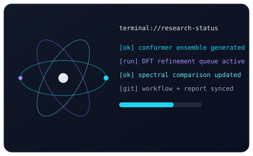
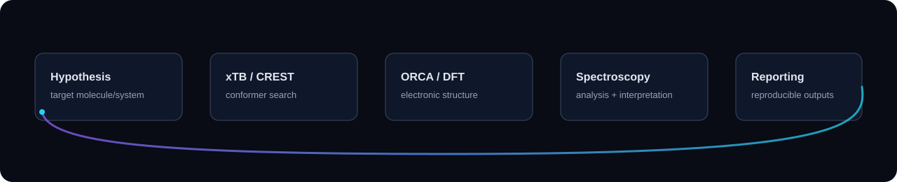
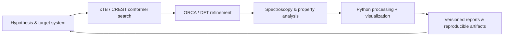

  

   

  
  
  
  

  <h3><code>chemistry → computation → software → discovery</code></h3>
  
<strong>Asif Raza</strong> · M.Sc. Chemistry @ Jamia Millia Islamia · CQDs · DFT · Spectroscopy · Catalysis · Scientific Software

---

## 🧭 Navigation

  <a href="#-research-dashboard">Research Dashboard</a> •
  <a href="#-workflow-map">Workflow Map</a> •
  <a href="#-featured-work">Featured Work</a> •
  <a href="#-toolchain">Toolchain</a> •
  <a href="#-roadmap">Roadmap</a> •
  <a href="#-contribution-signal">Contribution Signal</a> •
  <a href="#-connect">Connect</a>

---

## 🔬 Research Dashboard

<table>
<tr>
<td width="64%" valign="top">

### Focus Areas

- **Carbon quantum dots (CQDs):** synthesis-to-property understanding for functional materials
- **Computational chemistry:** xTB/CREST pre-screening with ORCA/DFT refinement
- **Spectroscopy + catalysis:** mechanism-aware interpretation and reproducible analysis
- **Scientific software:** Python + Linux workflows for transparent research pipelines

> Building practical, reproducible chemistry workflows where notebooks, scripts, and data can be audited and reused.

</td>
<td width="36%" valign="top" align="center">

</td>
</tr>
</table>

---

## 🧪 Workflow Map

  

<strong>Pipeline notes (click to expand)</strong>

- **Sampling first:** fast pre-screening reduces expensive DFT cycles.
- **Refine intentionally:** higher-level methods only for meaningful candidate sets.
- **Track provenance:** input, method level, and output are versioned together.
- **Keep it reusable:** scripts are designed for reruns and adaptation.

---

## 🧰 Featured Work

<table>
<tr>
<td width="50%" valign="top">

### ⚗️ [HASIM](https://github.com/asifverse4)

Computational chemistry direction under active development around reproducible simulation workflows and scientific automation.

</td>
<td width="50%" valign="top">

### 🧫 [LabScribber](https://github.com/asifverse4/LabScribber)

Lab-oriented tooling and notes to make experiments, observations, and analysis easier to organize and revisit.

</td>
</tr>
<tr>
<td width="50%" valign="top">

### 🔭 CQD/DFT Study Stack

Current stack direction: **xTB/CREST → ORCA/DFT → spectroscopy interpretation → reproducible outputs**.

</td>
<td width="50%" valign="top">

### 🧱 Open Build Philosophy

Readable scripts, explicit assumptions, and incremental improvements over opaque one-off runs.

</td>
</tr>
</table>

> Publication and manuscript-ready outputs are a target direction; roadmap items below are listed as ongoing goals.

---

## ⚙️ Toolchain

---

## 🛰️ Live Stats

  
  
   
  

---

## 🗺️ Roadmap

- [x] Establish a chemistry-computation profile architecture
- [x] Build reusable animated scientific visuals in SVG
- [ ] Expand reproducible examples for DFT and spectroscopy workflows
- [ ] Add more openly documented computational notebooks
- [ ] Package repeatable automation for data-to-report pipelines
- [ ] Grow collaboration-ready project documentation

---

## 🐍 Contribution Signal

  

---

## 🤝 Connect

  
  
  

  Designed for GitHub profile rendering with lightweight SVG animation and reproducible content links.

